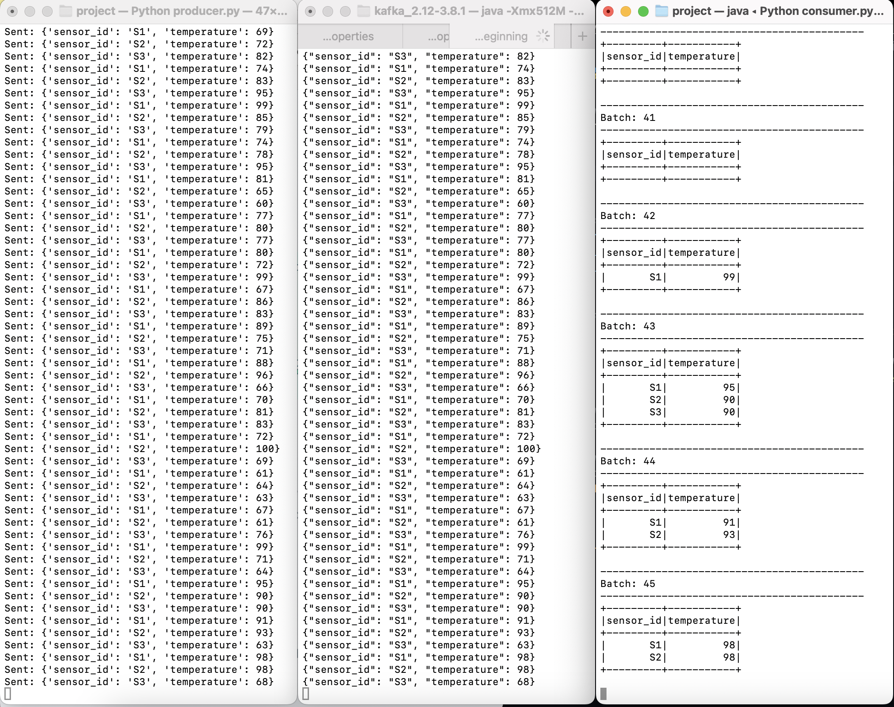

## 📡 Pengumpulan Data Sensor IoT dengan Apache Kafka dan PySpark

### 👥 Anggota Kelompok
| Nama                    | NRP         |
|-------------------------|-------------|
| Mutiara Nurhaliza       | 5027221010  |
| Rehana Putri Salsabilla | 5027221015  |

### 📝 Deskripsi Proyek
Simulasi pengumpulan dan pemrosesan data dari sensor suhu di mesin pabrik menggunakan Apache Kafka dan PySpark. Data dikirim secara real-time setiap detik oleh beberapa sensor yang menghasilkan data suhu acak. Kafka digunakan sebagai penghubung aliran data, sementara PySpark digunakan untuk memfilter data yang dihasilkan, khususnya mendeteksi suhu tinggi (di atas 80°C) sebagai tanda peringatan sederhana.

### 📝 Tugas 
#### 1. Buat Topik Kafka untuk Data Suhu:<br>
Buat topik di Apache Kafka bernama "sensor-suhu" yang akan menerima data suhu dari sensor-sensor mesin.

#### 2. Simulasikan Data Suhu dengan Producer:<br>
Buat producer sederhana yang mensimulasikan data suhu dari beberapa sensor mesin (misalnya, 3 sensor berbeda).
Setiap data suhu berisi ID sensor dan suhu saat ini (misalnya, sensor_id: S1, suhu: 70°C), dan dikirim setiap detik ke topik "sensor-suhu".

#### 3. Konsumsi dan Olah Data dengan PySpark:<br>
Buat consumer di PySpark yang membaca data dari topik "sensor-suhu".
Filter data suhu yang berada di atas 80°C, sebagai indikator suhu yang perlu diperhatikan.

#### 4. Output dan Analisis:<br>
Cetak data yang suhu-nya melebihi 80°C sebagai tanda peringatan sederhana di console.

### 📑 Daftar Isi
| No  | Deskripsi                                  |
|-----|--------------------------------------------|
| 1   | [Persyaratan Sistem](#persyaratan-sistem)  |
| 2   | [Instalasi](#instalasi)                    |
| 3   | [1. Buat Topik Kafka untuk Data Suhu](#buat-topik-kafka-untuk-data-suhu) |
| 4   | [2. Simulasikan Data Suhu dengan Producer](#simulasikan-data-suhu-dengan-producer)      |
| 5   | [3. Konsumsi dan Olah Data dengan PySpark](#konsumsi-dan-olah-data-dengan-pyspark) |
| 6   | [Struktur Kode](#struktur-kode)      |
| 7   | [4. Output](#output)        |

---

### 1️⃣ Persyaratan Sistem
| Software               | Versi Minimum       |
|------------------------|---------------------|
| Apache Kafka           | 2.8.0               |
| PySpark                | 3.0.1               |
| Python                 | 3.8                 |
| Java (untuk Kafka)     | 1.8 atau lebih tinggi|


### 🛠️ Instalasi

1. **Install Kafka**
   - Unduh Apache Kafka dari [situs resmi](https://kafka.apache.org/downloads) dan ekstrak file ZIP atau TAR.
   - Tambahkan Kafka ke `PATH` dengan menambahkan `bin` directory ke konfigurasi sistem.
   - Mulai Zookeeper dan Kafka dengan perintah:
     ```bash
     # Mulai Zookeeper
     bin/zookeeper-server-start.sh config/zookeeper.properties

     # Mulai Kafka
     bin/kafka-server-start.sh config/server.properties
     ```

2. **Install Dependencies Python**
   - Install package yang dibutuhkan, seperti `kafka-python` untuk producer dan PySpark untuk consumer.
     ```bash
     pip install kafka-python pyspark
     ```

## Tugas
### 🚀 1. Buat Topik Kafka untuk Data Suhu

Langkah 1 **Buat Topik untuk Data Sensor**
   - Jalankan perintah ini untuk membuat topik bernama `sensor-suhu` di Kafka:
     ```bash
     bin/kafka-topics.sh --create --topic sensor-suhu --bootstrap-server localhost:9092 --partitions 1 --replication-factor 1
     ```

Langkah 2 **Cek Topik**
   - Pastikan topik `sensor-suhu` berhasil dibuat:
     ```bash
     bin/kafka-topics.sh --list --bootstrap-server localhost:9092
     ```

### ▶️ 2. Simulasikan Data Suhu dengan Producer

Langkah 1 **Membuat dan Menjalankan Code Producer**
- **Kode Producer** akan mengirim data suhu acak dari tiga sensor setiap detik.
- Simpan kode berikut di file bernama `producer.py` dan jalankan.

   ```python
   from kafka import KafkaProducer
   import time
   import json
   import random

   producer = KafkaProducer(bootstrap_servers='localhost:9092',
                            value_serializer=lambda v: json.dumps(v).encode('utf-8'))

   sensor_ids = ['S1', 'S2', 'S3']

   while True:
       for sensor_id in sensor_ids:
           temperature = random.randint(60, 100)
           data = {
               'sensor_id': sensor_id,
               'temperature': temperature
           }
           producer.send('sensor-suhu', value=data)
           print(f'Sent: {data}')
       time.sleep(1)
   ```

  Langkah 2 **Menjalankan Producer**:
   ```bash
   python producer.py
   ```
### 3. ▶️ Konsumsi dan Olah Data dengan PySpark   
Langkah 1 **Membuat dan Menjalankan Code Consumer**
- **Kode Consumer** akan membaca data dari topik `sensor-suhu` dan menampilkan data suhu di atas 80°C sebagai peringatan.
- Simpan kode berikut di file bernama `consumer.py` dan jalankan.

   ```python
   from pyspark.sql import SparkSession
   from pyspark.sql import functions as F
   from pyspark.sql.types import StructType, StructField, StringType, IntegerType

   spark = SparkSession.builder \
       .appName("Sensor Temperature Consumer") \
       .config("spark.jars.packages", "org.apache.spark:spark-sql-kafka-0-10_2.12:3.0.1") \
       .getOrCreate()

   df = spark.readStream \
       .format("kafka") \
       .option("kafka.bootstrap.servers", "localhost:9092") \
       .option("subscribe", "sensor-suhu") \
       .load()

   schema = StructType([
       StructField("sensor_id", StringType(), True),
       StructField("temperature", IntegerType(), True)
   ])

   sensor_data = df.selectExpr("CAST(value AS STRING)").select(F.from_json(F.col("value"), schema).alias("data"))
   sensor_data = sensor_data.select("data.sensor_id", "data.temperature")
   filtered_data = sensor_data.filter(sensor_data.temperature > 80)

   query = filtered_data.writeStream \
       .outputMode("append") \
       .format("console") \
       .start()

   query.awaitTermination()
   ```

Langkah 2 **Menjalankan Consumer**:
   ```bash
   spark-submit consumer.py
   ```

### 🗂️ Struktur Kode

- **producer.py**: Script yang mensimulasikan data suhu dari beberapa sensor dan mengirimkannya ke topik `sensor-suhu` di Kafka setiap detik.
- **consumer.py**: Script PySpark yang membaca data suhu dari topik `sensor-suhu`, memfilter suhu di atas 80°C, dan mencetak data tersebut di console.

### 📌 Catatan Tambahan
- Pastikan Kafka dan Zookeeper sudah berjalan sebelum menjalankan producer dan consumer.
- Pastikan semua dependencies sudah terpasang sesuai dengan versi yang digunakan di Spark dan Kafka.

### 📊 4. Output
Hasil pengujian berupa output dari consumer di PySpark yang memfilter data suhu di atas 80°C dan menampilkannya di console. Setiap data suhu berisi ID sensor dan suhu saat ini, seperti `sensor_id: S1, suhu: 70°C`. Consumer membaca data dari topik "sensor-suhu" dan hanya menampilkan suhu yang berada di atas 80°C sebagai indikator suhu yang perlu diperhatikan.



> **Gambar**: Output menunjukkan data suhu yang dikirim oleh producer ke topik `sensor-suhu`. Consumer PySpark membaca data ini, dan suhu yang melebihi 80°C dicetak di console sebagai tanda peringatan.

